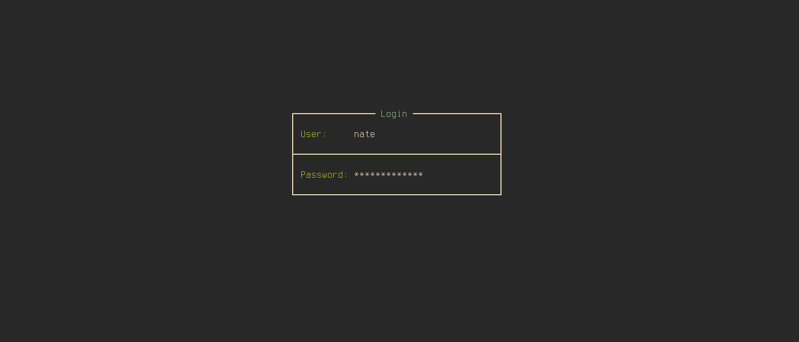

# tui-lock
 
A [gtklock](https://github.com/jovanlanik/gtklock) module that replaces the default lock screen with a TUI-style terminal interface rendered via VTE.


 
## Features
 
- Full-screen VTE terminal overlay as the lock screen surface
- Blank VTE surfaces on secondary monitors for a consistent look
- Works alongside gtklock's built-in authentication
 
## Dependencies
- gtklock
- gtk3
- vte3 (vte-2.91)
- gtk-session-lock
- pkgconf
- make
- clang
- pango
 
### Arch Linux
 
```bash
pacman -S gtk3 vte3 gtk-session-lock gtklock pkgconf clang pango
```
 
## Building
 
Clone with submodules:
 
```bash
git clone --recurse-submodules https://github.com/NateTheGrate/tui-lock.git
cd tui-lock
```
 
If you already cloned without `--recurse-submodules`:
 
```bash
git submodule update --init
```
 
Build:
 
```bash
make
```
 
The output is `build/tui-lock.so`.
 
## Usage
 
Run gtklock with the module:
 
```bash
gtklock -m /path/to/build/tui-lock.so
```
 
Or add it to your gtklock config (`~/.config/gtklock/config.ini`):
 
```ini
[main]
modules=/path/to/build/tui-lock.so
```
